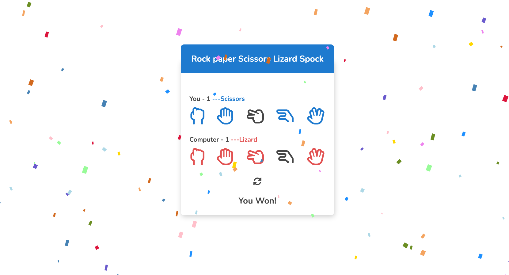
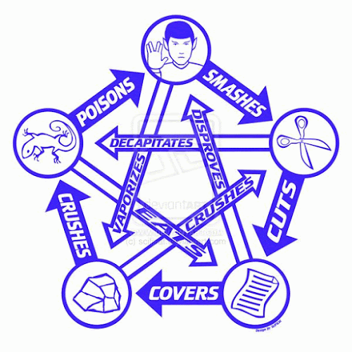

#  Rock Paper Scissors Lizard Spock

Have you ever watched the "Big Bang Theory" series? In  that Sheldon introduces a new game so similar to the routine kids "Rock Paper Scissors" game.

YouTube Link : https://www.youtube.com/watch?v=405Nh2H4Ucg

## Table of contents

- [Overview](#overview)
  - [Screenshot](#screenshot)
  - [Links](#links)
- [My process](#my-process)
  - [Built with](#built-with)
  - [What I learned](#what-i-learned)
  - [Continued development](#continued-development)
  - [Useful resources](#useful-resources)
- [Author](#author)
- [Acknowledgments](#acknowledgments)

## Overview
I have tried to implement the game rules in a way you can play with the computer system. Not very fancy, however, I really enjoyed every piece of the development process. Hope you Love that 😍!

### Screenshot

### Links

- Solution URL: https://github.com/ShayanFaghihi/spock-rock-game
- Live Site URL: https://shayanfaghihi.github.io/spock-rock-game/

## My process
The whole layout has been created using Flex Box! The hard part was implementing the logic of the game. I've used Switch Case JavaScript format to compare user and computer selected weapon.

### Built with

- Semantic HTML5 markup
- CSS custom properties
- Flexbox
- Mobile-first workflow
- Vanilla JavaScript
- Modular JS
- Confetti library

## Author

- Website - [Shayan Faghihi](https://shayan-faghihi.ir)
- Twitter - [@Shayan_Faghihi](https://twitter.com/Shayan_Faghihi)
